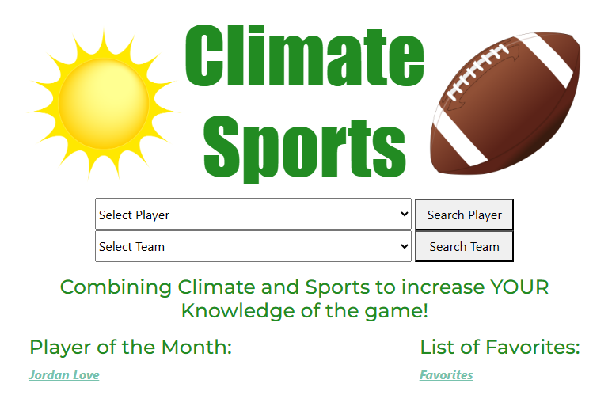

# Climate Sports



## Application Overview

Our application is designed to provide users with detailed player and team statistics from various sports leagues. Users can search for players, view their stats, select their own favorite players and teams, and access advanced metrics for deeper analysis.


## Deployment Guide

### Order of Steps

1. Clone the repository.
2. Set up the database.
3. Configure the application.
4. Build and run the application.

### Quick Start to Get the Application Running

1. **Clone the Repository**
   - Clone this repository to your local machine:
     ```
     git clone https://github.com/cdc00015/353HW1Carr.git
     ```

2. **Database Setup**
   - Create the necessary database for the application.
   - Execute the SQL queries provided in the [SQL](/SQL) folder to set up the database's tables and stored procedures.
- Begin by executing the [NFLWeatherAppDBCreation.sql](/SQL/NFLWeatherAppDBCreation.sql) file to initially create the database. 
- Then you will need to execute the [NFLWeatherAppDBData.sql](/SQL/NFLWeatherAppDBData.sql) file, as well as both [PlayerFavdata.sql](/SQL/PlayerFavData.sql) and [TeamFavData.sql](/SQL/TeamFavData.sql) which all deal with populating the database with our mock data. 
- Finally you will need to execute each of our stored procedures files, the order does not matter, but you will need [CarsonMealeySPs](/SQL/CarsonMealeySPs), [CristoferCarrSPs](/SQL/CrisoferCarrSPs), and [JacobWilliamsonSPs](/SQL/JacobWilliamsonSPs) in order for the apis on the website to work properly. 

3. **Configuration**
- We used a local database through SQL Server Management Studio for this project
- To run this project on your own, you will need to modify the database connection string in `appsettings.json` within both the [353HW1Carr](/353HW1Carr) and the [NFLWeatherAppAPI](/NFLWeatherAppAPI) to match your database connection string.

4. **Build and Run**
   - Build and run the application using Visual Studio
   - On the right-hand side of the `Start` button, make sure that within the `Configure Start Up Projects` button from the dropdown menu, you set the project to start both the website **and** the API project to ensure that everything will work as expected. 

### Pitfalls to Avoid

- Check to make sure you have executed all SQL queries found within the [SQL folder](/SQL)
- Ensure that both of the database connection strings are configured correctly.
- While you should not need to, double check for any missing dependencies that may cause build or runtime errors.

### Getting Help

If you encounter any errors, 
- Check the application logs for detailed error messages.
- Search for similar issues on [Google](www.google.com) or on [Stack Overflow](https://stackoverflow.com/).
- Reach out to the project team for assistance at BizzareBytes@email.com

---

## API Documentation

### PlayerGetBasicStats

- **Description**: Retrieves basic information and stats of a player.
- **Inputs**: PlayerID
- **Outputs**: Basic player information and player statistics.
- **Usage**: Call the API with a PlayerID to fetch the data.

### PlayerGetAdvanceStats

- **Description**: Retrieves advanced statistics for a player.
- **Inputs**: PlayerID
- **Outputs**: Calculated advanced stats based on player's performance.
- **Usage**: Invoke the API with a PlayerID to retrieve advanced stats.

### TeamGetBasicStats

- **Description**: Fetches basic statistics of a specific team.
- **Inputs**: TeamID.
- **Outputs**: Basic team information and performance stats.
- **Usage**: Provide the TeamID to the API for data retrieval.

### TeamGetAdvancedStats

- **Description**: Retrieves advanced statistics for a team.
- **Inputs**: TeamID.
- **Outputs**: Calculated advanced stats based on the team's performance.
- **Usage**: Submit the TeamID to the API to obtain advanced stats.

### ShowFavoritePlayer

- **Description**: Displays a user's list of favorite players.
- **Inputs**: User's UserID.
- **Outputs**: List of players marked as favorites by the user.
- **Usage**: Provide the UserID to fetch and display favorite players.

### ShowFavoriteTeam

- **Description**: Shows a user's list of favorite teams.
- **Inputs**: User's UserID.
- **Outputs**: List of teams marked as favorites by the user.
- **Usage**: Use the UserID to retrieve and showcase favorite teams.


## Developer Documentation

### Prerequisites

- Knowledge of C# and ASP.NET Core.
- Understanding of Entity Framework Core for database interactions.
- Familiarity with SQL Server for database management.

### Components and Architecture

- **Controllers**: Handle incoming requests and process data.
- **Services**: Implement business logic and interact with data repositories.
- **Models**: Define entities and data structures.
- **Views (Razor Pages)**: Render dynamic content based on controller actions.

### Key Functionalities

- **Player and Team Statistics**: Retrieve and display player/team data using APIs.
- **Favorite Management**: Allow users to mark and manage favorite players/teams.
- **Database Interaction**: Implement CRUD operations using Entity Framework Core.

### Development Environment Setup

1. Clone the repository and set up the database.
2. Configure the application settings and database connection string.
3. Install required dependencies using NuGet Package Manager.
4. Build and run the application to test functionality.

### Helpful Resources

- Refer to existing codebase and comments within code for implementation details.
- Use version control (Git) for managing changes and collaboration.
- Leverage Visual Studio debugging tools for troubleshooting.

## ChatGPT Prompts
Gave ChatGPT my code in my AdvanceStats class and told it I had a CS1519 error and asked what was wrong. It told me I had an extra '[Required]' at the end of my code.

Gave ChatGPT my code for the PlayerService Repo and told it I had a CS0029 error and asked what was wrong. It told me I connected the Player class instead of AdvanceStats for my PlayerGetAdvanceStats API.

Gave ChatGPT my code for the TeamsController and told it I was getting a fetch error response 500 and it told me to alter my "HTTP Get" code and that helped fix the issue.

>Could you help me with making some mock data for the following sql server table? and I have users with userid's 1 through 10, and teams with teamid's 1 through 10...

This quickly returned a useful SQL insert query that saved us from having to create mock data manually. 

>Hey in my asp.net core web app, I have two sql server stored procedures turned to apis, however they're returning duplicated values... What could be causing this miscommunication between my sql server and my front end pages within this asp.net8.0 core web app?

>Can you help me create a basic privacy policy page in cshtml for use within this NFL weather app asp.net core web application?

>Hey based on everything we've discussed, can you help me write a basic deployment guide in markdown for use in my project's readme.md? 
---
<br/><br/>
# 353 HW#1
## Project Overview
My goal for my project is to have a website where people can enter a player and the climate they wants the stats for that player and my website be able to give it to them. Right now my project is very early one. It has a search bar and drop down menu but they are not currently working.
## Page Descriptions
| Page | Description |
|-----:|-----------|
|     Index| My first page is the main page. It has a search bar where the user is supposed to enter the player or team they are looking for. The drop down menus are for the climate they want to use. My search button currently changes the url for the climate, but not player. I also have a link leading to my second page which is early mock up of a player page.|
|     JL10| The player’s page has two tables on. One is being hidden by a button that appears whenever the user clicks it. I would like to add more stats and data into my player profiles later.  |

## Onlines Research
### Websites
#### [The Football Database](https://www.footballdb.com/stats/index.html)
The website has 6 drop down selections to pick from different stats such as year, statistic, and league. The website also has a submit button. Once the user clicks submit it takes the user to a new page that has those statistics. The website then goes to a new page. For each drop down they have a “/” and then the stat that is chosen. For this submit press, the user choose NFL as the league, passing stats, 2023 season, and the regular season. This would be a good way to change to different screens using the slashes
#### [Pro Football Reference](https://www.pro-football-reference.com/)
This website shows all stats for a player instead of stat leaders for specific leaders for different stats and bacsue of this the website uses more simplier url. They pro-football-reference.com/”player, team, awards etc”/”1-3 letter code”/”optional more specific combitnation”. For exmaple Jordan Love for be pro-football-reference.com/player/L/LoveJo03.html. For the tables that the website uses to show the information for the player, they grab information for a dataset that has all the players information and statistics. They also set up a formula for the information in order to get the right numbers. For example, ccompletion percentage it set it equal to completed passes/pass attempts. It has a minimum value that the player must reach in order for the website to use it.
#### [Statmuse](https://www.statmuse.com/nfl)
The search bar is made using different styles. The search bar starts with the style of the search bar area. It takes out the default format and adds some such as transparency and the size of the border. The website uses “aria-autocomplete=”list”. This uses technology that looks at psat people’s requests and gives suggestions based on what is most likely. The website uses enterkeyhint=”search” in order to allow to user to search by clicking enter on the keyboard. The text area of the search bar has required=”” that does not allow the user to hit enter or search unless something is in the search bar.
### Repositories
#### [sports.db](https://github.com/devdr3/sport.db/blob/master/README.md)
For the github repositories I looked at their READMEs to see how to write mine and some ideas to put inside of mine. They explained in their README how to use their product and what their website can do. They list all the stats that you can find using their website. I plan to do the same thing later once I get more along in my project. For now I will just be doing what is required by the assignment. It also shows what the querries that were used for the project. While I am not looking to add sql to my project yet, it could be useful later one.
#### [Sports Dataverse](https://github.com/sportsdataverse/)
For this I didn’t really use much of the code but some ideas they had to show their information and stats. They used a lot of graphs to show stats and relationships. I may want to use graphs for my website later once I get further along. It would cool to create a way to automatically make graphs of the stats that the user would want.
## Future Enhancements
There are so many things my website needs because of how early I am in the process. Here is a list of my main goals for the website:
* Create working search bar
* Add more data for each player
* Make more pages for players and/or teams
* Make the website prettier
## Citations
### W3 Resources
[Bootstrap Image](https://www.w3schools.com/bootstrap5/bootstrap_images.php)
[Java Script Button](https://www.w3schools.com/js/js_intro.asp)
### ChatGPT Prompts
Asked how I can put an image and text into one line and it introduced me to the display: flex; feature.

I gave ChatGPT my html code for my search bar and my dropdown and asked it to center it and put my search bar above the dropdowns. I used the code it gave me to change the location of my search bar and drop down.

I gave ChatGPT my table data and asked for the table to become wider, black border, bold first row, and make every other row light grey. I used the csss that it gave me.

I asked ChatGPT to break down a bit of code for Statmuse. This helped me understand what the code was a little better.
## Reflections of Resources
The research that I did was less important that I thought for the technical side. I ultimately used our class notes and w3 for all of code. I want to make the website prettier. I need it so my search button actual works and sends the user to the place they looking to. I also need to find a way to get the data and put it on my website. My greatest resource was ChatGPT. The other websites that I researched did not really help me bacause looking at their code just made me more confused. ChatGPT helped my most with my css and formating. I also used the code we used from class because I have it in front of me and it was the most convenient to learn from.
